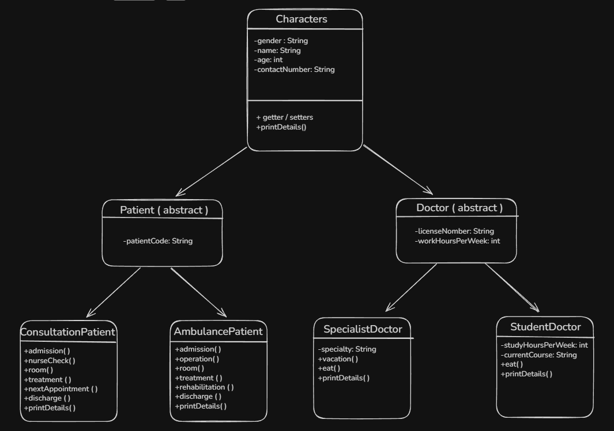

# The Hospital - Java OOP Project

## Project Description
This is an academic Java project created to practice core Object-Oriented Programming concepts:
- Encapsulation
- Inheritance
- Polymorphism
- Abstraction
- SOLID principles

## Class Structure


The project is organized around an inheritance hierarchy:

```text
Characters (abstract)
 |- Patient (abstract)
 |    |- ConsultationPatient
 |    `- AmbulancePatient
 `- Doctor (abstract)
      |- SpecialistDoctor
      `- StudentDoctor
```

## OOP Concepts Applied
### Encapsulation
All attributes are private and accessed through getters and setters.

### Inheritance
`Patient` and `Doctor` extend `Characters`.
Concrete classes extend these abstract classes.

### Polymorphism
`printDetails()` is overridden in all concrete classes and called through a `Characters` reference in `Main`.

### Abstraction
`Characters`, `Patient`, and `Doctor` are abstract classes.

### SOLID
- Single Responsibility Principle: each class has a clear and focused purpose.
- Open/Closed Principle: new character types can be added without modifying existing classes.

## How to Run
- Open the project in IntelliJ IDEA.
- Run `Main.java`.
- Or run Maven from terminal:

```bash
mvn clean test
```

## Example Output
```text
=== Hospital Management ===
Patient: Maria Lopez
Type: Consultation
Assigned Doctor: Dr. Smith
Diagnosis: Flu symptoms
```
